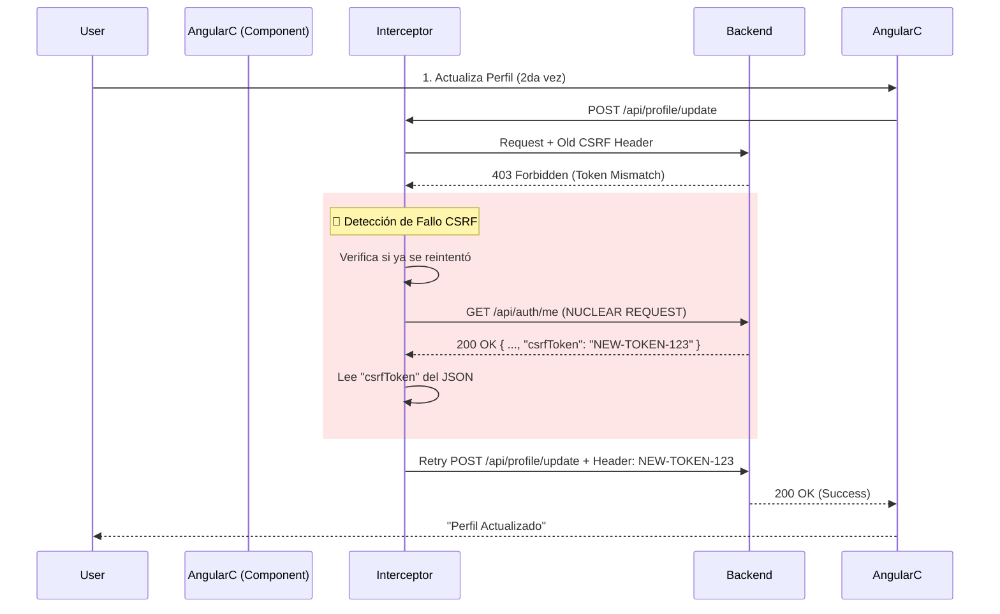

# Workflow de Estabilización de Autenticación

Este documento consolida la arquitectura, soluciones y procedimientos de verificación para el sistema de autenticación, resolviendo definitivamente los problemas de sincronización de sesiones, redirecciones infinitas y fallos de CSRF.

## 1. Arquitectura de Solución ("Estrategia Nuclear Híbrida")

Para garantizar la estabilidad en entornos modernos (SPA + Cloudflare + Spring Security 6), hemos implementado una arquitectura híbrida:

### A. Gestión de CSRF (Doble Blindaje)
1.  **Operación Normal (Cookies):** En el flujo habitual, Angular lee la cookie `XSRF-TOKEN` y la envía en el header.
2.  **Recuperación Infalible (JSON):** Si ocurre un error `403 Forbidden` (token desincronizado o expirado), el interceptor activa la **"Solución Nuclear"**:
    - Solicita `/api/auth/me`.
    - Lee el nuevo token CSRF **directamente del cuerpo JSON** de la respuesta.
    - **Por qué:** Elimina la dependencia de `document.cookie`, tiempos de espera del navegador y condiciones de carrera.

### B. Configuración de Cookies y Transporte Híbrido (Fallback)
Las cookies primarias (`HttpOnly`) son el método preferido por seguridad. Sin embargo, para entornos con restricciones estrictas de dominio/puerto (ej. localhost vs dominio simulado) donde el navegador bloquea cookies, implementamos una **Estrategia Híbrida de Transporte**:

1.  **Backend (`AuthService` / `LoginResponse`)**: Retorna el JWT en el cuerpo de la respuesta (`token`), además de establecer la cookie.
2.  **Frontend (`AuthService`)**: Guarda este token en `localStorage` como respaldo.
3.  **Frontend (`AuthInterceptor`)**:
    *   Siempre envía `withCredentials: true` (para intentar Cookies).
    *   **Además**, inyecta el header `Authorization: Bearer <token>` si el token existe en `localStorage`.

### C. Filtro de Seguridad (`com.project.backend_api.auth.JwtTokenFilter.java`) Reforzado
El filtro de seguridad implementa una **Estrategia Híbrida (Priorización)**:
1.  **Prioridad 1 (Header)**: Intenta leer el header `Authorization: Bearer <token>`. Es la fuente más confiable para SPAs y evita problemas de "Third-party Cookies".
2.  **Prioridad 2 (Cookie)**: Si el header no existe, lee la cookie `auth_token` (HttpOnly).
3.  **Contexto**: Inyecta `CustomUserDetails` con el `companyId` (recuperado de cookie `companyContext` o cabecera `X-Company-Id`).

---

## 2. Diagrama de Flujo (Corregido)

### Escenario: Recuperación de Sesión (Perfil / CSRF)



---

## 3. Checklist de Verificación (QA)

Utiliza esta lista antes de cualquier despliegue para asegurar que la autenticación sigue siendo robusta.

### ✅ Pruebas Manuales Críticas

#### 1. Acceso a Landing Page
- [ ] **Acción:** Entrar a `http://localhost:4200/` (o dominio prod) en modo incógnito.
- [ ] **Esperado:** Se carga la Landing Page. NO hay redirección al Login.
- [ ] **Verificación:** Consola limpia de errores "401".

#### 2. Login Fallido (Control de Errores)
- [ ] **Acción:** Intentar login con password incorrecto.
- [ ] **Esperado:** Mensaje "Credenciales incorrectas".
- [ ] **Verificación:** Consola muestra "[AuthInterceptor] 401 en endpoint público. NO se intentará refresh". NO debe intentar llamar a `/refreshtoken`.

#### 3. Prueba de Fuego: Perfil Consecutivo
- [ ] **Acción:** Login -> Ir a Perfil -> Cambiar Teléfono -> Guardar.
- [ ] **Acción (Inmediata):** SIN recargar página, cambiar Teléfono de nuevo -> Guardar.
- [ ] **Esperado:** Ambas actualizaciones exitosas.
- [ ] **Verificación:** Si falla el token, deberías ver en consola: "[AuthInterceptor] ✅ CSRF renovado desde JSON".

#### 4. Navegación SPA
- [ ] **Acción:** Navegar Home -> Perfil -> Seguridad -> Home.
- [ ] **Esperado:** Navegación fluida, sin logouts involuntarios.

---

## 4. Guía de Solución de Problemas (Troubleshooting)

### Síntoma: "CSRF token not found in /me response"
*   **Causa:** El backend no está inyectando el token en el JSON.
*   **Solución:** Verificar `AuthController.java`, método `getCurrentUser`. Debe tener `request.getAttribute(CsrfToken.class.getName())`.

### Síntoma: Loop infinito en Login
*   **Causa:** El endpoint `/api/auth/login` no está en la lista `PUBLIC_ENDPOINTS` del interceptor.
*   **Solución:** Agregar la URL exacta a la lista en `auth.interceptor.ts`.

*   **Solución:** `SameSite=None` REQUIERE `Secure=true`. Configurar la env var `APP_SECURITY_COOKIE_SECURE=true`.

### Síntoma: "ClassCastException: class jdk.proxy... cannot be cast to CustomUserDetailsService"
*   **Causa:** Spring Security envuelve el servicio en un Proxy para manejar transacciones y seguridad.
*   **Solución:** Inyectar directamente `com.project.backend_api.security.CustomUserDetailsService` (clase) usando `@Autowired` y `@Lazy` en el filtro.

---

## 5. Comandos de Mantenimiento

**Reconstruir todo el stack (recomendado tras cambios de auth):**
```bash
docker-compose down -v  # ¡Cuidado! Borra volúmenes de DB si no son externos
# O mejor:
docker-compose up -d --build --force-recreate
```

**Ver logs de autenticación en tiempo real:**
```bash
docker logs -f app_backend | grep "Auth"
```
