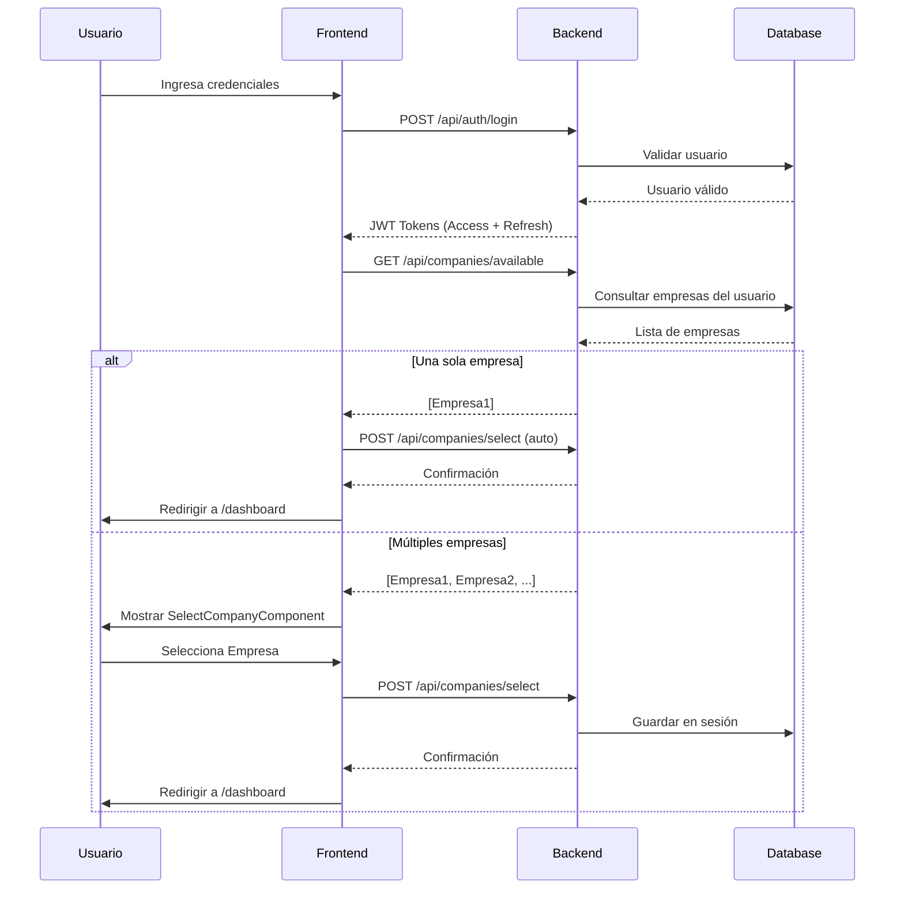

# Sistema de Selección de Compañía

Este documento describe la arquitectura y funcionamiento del sistema de selección de compañía (multi-tenant) implementado en la plataforma.

---

## 1. Objetivo y Contexto

El **selector de compañía** es un componente crítico en aplicaciones multi-tenant (multi-empresa) que permite a los usuarios acceder a diferentes empresas según sus permisos. Este sistema implementa una interfaz "Human-Centric" que optimiza la experiencia del usuario mediante:

*   **Auto-Skip Inteligente**: Si el usuario tiene acceso a una sola empresa, se salta automáticamente la pantalla de selección.
*   **Selección Visual Premium**: Para usuarios con acceso a múltiples empresas, se presenta una interfaz glassmorphic con animaciones suaves.
*   **Gestión de Permisos**: Administradores y super administradores tienen acceso a todas las empresas.

---

## 2. Casos de Uso

### Caso 1: Usuario con Acceso a Una Sola Empresa
**Flujo**:
1.  El usuario inicia sesión exitosamente.
2.  El sistema consulta las empresas disponibles → Resultado: 1 empresa.
3.  **Auto-selección**: La empresa se selecciona automáticamente.
4.  **Redirección directa** al dashboard sin mostrar la pantalla de selección.

**UX**: Experiencia fluida sin pasos innecesarios.

---

### Caso 2: Usuario con Acceso a Múltiples Empresas
**Flujo**:
1.  El usuario inicia sesión exitosamente.
2.  El sistema consulta las empresas disponibles → Resultado: 2+ empresas.
3.  Se muestra la pantalla `SelectCompanyComponent`.
4.  El usuario selecciona visualmente la empresa deseada.
5.  El sistema guarda la selección en la sesión del usuario.
6.  Redirección al dashboard con contexto de empresa activa.

**UX**: Selector visual claro con feedback inmediato.

---

### Caso 3: Super Administrador
**Flujo**:
1.  El usuario inicia sesión como `isSuperAdmin`.
2.  El sistema consulta → Resultado: **Todas las empresas** del sistema.
3.  Se muestra el selector con todas las empresas disponibles.
4.  El administrador selecciona la empresa que desea gestionar.

**UX**: Acceso total para tareas administrativas.

---

## 3. Arquitectura del Sistema

### Componentes Frontend (Angular)

#### A. `SelectCompanyComponent`
**Ubicación**: `frontend-app/src/app/auth/select-company/select-company.component.ts`

**Responsabilidades**:
*   Cargar la lista de empresas disponibles desde el backend.
*   Implementar lógica de auto-skip para usuarios con una sola empresa.
*   Renderizar cards interactivas con diseño glassmorphismo.
*   Gestionar estados de carga, error y selección.
*   Enviar la selección al backend y redirigir al dashboard.

**Estados del Componente**:
*   `loading`: Indica si se están cargando las empresas.
*   `error`: Almacena mensajes de error.
*   `companies`: Lista de empresas disponibles.
*   `selecting`: Indica si se está procesando la selección.

**Métodos Clave**:
```typescript
loadCompanies(): void {
  // GET /api/companies/available
  // El backend retorna la lista basado en el usuario autenticado
  // Si 0 empresas → Mostrar error "No tienes acceso"
  // Si 1 empresa → Auto-seleccionar y redirigir
  // Si 2+ empresas → Mostrar selector visual
}

selectCompany(companyId: string): void {
  // POST /api/companies/select
  // Backend establece la cookie 'companyContext'
  // Redirigir al Dashboard
}
```

**Diseño UI**:
*   **Glassmorphism Premium**: Fondo difuminado con backdrop-filter.
*   **Ambient Glow**: Efecto de iluminación radial de fondo.
*   **Cards Interactivas**: Hover con escalado, glow y cambio de color.
*   **Animaciones Stagger**: Cada card aparece secuencialmente con delay (0.2s, 0.3s, 0.4s...).
*   **Theme Toggle**: Botón de cambio de tema (light/dark) en la esquina superior derecha.

---

### Componentes Backend (Spring Boot)

#### B. `CompanyController` (Implementado)
**Ubicación**: `backend-api/src/main/java/com/project/backend_api/controller/CompanyController.java`

**Endpoints**:

1.  **`GET /api/companies/available`**
    *   **Descripción**: Retorna las empresas a las que el usuario autenticado tiene acceso.
    *   **Autorización**: Requiere JWT válido.
    *   **Lógica de Negocio**:
        *   Si `user.isSuperAdmin()` → Retornar todas las empresas del sistema.
        *   Si usuario normal → Consultar la tabla `security.user_company_roles` para obtener las empresas asociadas.
    *   **Respuesta**:
        ```json
        [
          {
            "id": "uuid-1",
            "name": "Empresa Alpha S.A.S.",
            "nit": "900123456-7"
          },
          {
            "id": "uuid-2",
            "name": "Tech Solutions Ltda.",
            "nit": "800987654-3"
          }
        ]
        ```

2.  **`POST /api/companies/select`**
    *   **Descripción**: Guarda la empresa seleccionada en la sesión del usuario.
    *   **Body**:
        ```json
        {
          "companyId": "uuid-1"
        }
        ```
    *   **Lógica de Negocio**:
        *   Validar que el usuario tenga acceso a la empresa solicitada.
        *   Guardar `selectedCompanyId` en la sesión del usuario (o en un cache como Redis).
        *   Retornar confirmación.
    *   **Respuesta**:
        ```json
        {
          "message": "Empresa seleccionada exitosamente",
          "companyId": "uuid-1"
        }
        ```
    *   **Seguridad CSRF**: Este endpoint está excluido de la verificación CSRF estricta en `SecurityConfig.java` para facilitar el flujo de selección inicial, apoyándose en SameSite=Strict y CORS para la protección.

---

#### C. Gestión de Sesión (CompanyContext)
Para garantizar que el contexto de empresa esté disponible en toda la aplicación:

**Opción 1: HttpSession**
```java
@PostMapping("/select")
public ResponseEntity<?> selectCompany(
    @RequestBody SelectCompanyRequest request,
    HttpSession session,
    Principal principal
) {
    // Validar acceso
    // ...
    session.setAttribute("selectedCompanyId", request.getCompanyId());
    return ResponseEntity.ok(new SelectionResponse("Empresa seleccionada"));
}
```

**Opción 2: Custom ThreadLocal Context**
```java
public class CompanyContextHolder {
    private static final ThreadLocal<UUID> currentCompanyId = new ThreadLocal<>();
    
    public static void setCompanyId(UUID companyId) {
        currentCompanyId.set(companyId);
    }
    
    public static UUID getCompanyId() {
        return currentCompanyId.get();
    }
}
```

**Filtro de Inicialización**:
```java
@Component
public class CompanyContextFilter extends OncePerRequestFilter {
    @Override
    protected void doFilterInternal(HttpServletRequest request, ...) {
        UUID companyId = (UUID) request.getSession().getAttribute("selectedCompanyId");
        if (companyId != null) {
            CompanyContextHolder.setCompanyId(companyId);
        }
        filterChain.doFilter(request, response);
    }
}
```

---

## 4. Modelo de Datos

### Tabla: `security.companies`
| Columna                    | Tipo        | Descripción                           |
|:--------------------------|:-----------|:--------------------------------------|
| `id`                      | UUID        | Clave primaria                        |
| `name`                    | VARCHAR     | Nombre comercial de la empresa        |
| `nit`                     | VARCHAR     | NIT / Identificación fiscal (UNIQUE)  |
| `email_extension`         | VARCHAR     | Extensión de email corporativo        |
| `business_name`           | VARCHAR     | Razón social                          |
| `sector`                  | VARCHAR     | Sector económico (legacy)             |
| `sector_id`               | UUID        | FK → economic_sectors(id)             |
| `other_sector`            | VARCHAR     | Otro sector (campo libre)             |
| `employee_count`          | VARCHAR     | Rango de empleados                    |
| `address`                 | VARCHAR     | Dirección física                      |
| `phone`                   | VARCHAR     | Teléfono                              |
| `trial_ends_at`           | TIMESTAMP   | Fin del período de prueba             |
| `subscription_ends_at`    | TIMESTAMP   | Fin de la suscripción                 |
| `subscription_notification_pending` | BOOLEAN | Notificación pendiente       |
| `status`                  | BOOLEAN     | Estado activo/inactivo (default: true)|
| `created_at`              | TIMESTAMP   | Fecha de creación (auto)              |
| `updated_at`              | TIMESTAMP   | Fecha de actualización (auto)         |

### Tabla: `security.user_company_roles` (Relación Many-to-Many + Rol)
**Nota**: Esta tabla vincula usuarios con empresas y define su rol dentro de cada empresa.

| Columna       | Tipo    | Descripción                              |
|:-------------|:-------|:-----------------------------------------|
| `id`         | UUID    | Clave primaria                           |
| `user_id`    | UUID    | FK → `security.users(id)`                |
| `company_id` | UUID    | FK → `security.companies(id)`            |
| `role_id`    | UUID    | FK → `security.roles(id)` (opcional)     |
| `is_active`  | BOOLEAN | Si el acceso está activo                 |
| `created_at` | TIMESTAMP | Fecha de creación                       |

**Query para obtener empresas de un usuario**:
```sql
SELECT c.id, c.name, c.nit
FROM security.companies c
INNER JOIN security.user_company_roles ucr ON c.id = ucr.company_id
WHERE ucr.user_id = :userId 
  AND ucr.is_active = true 
  AND c.status = true
ORDER BY c.name;
```

**Query para verificar si un usuario es ROLE_ROOT**:
```sql
-- Los usuarios ROOT tienen acceso a todas las empresas del sistema
SELECT has_role('ROLE_ROOT', :userId);
```


---

## 5. Flujo de Autenticación Completo



---

## 6. Seguridad

### Validaciones Backend
1.  **Autorización**: El endpoint `/api/companies/available` debe validar que el usuario tenga un JWT válido.
2.  **Verificación de Acceso**: Al seleccionar una empresa, el backend **debe validar** que el usuario tenga permiso para acceder a esa empresa.
3.  **Auditoría**: Registrar cada cambio de empresa en la tabla `security.login_logs` o una tabla específica de auditoría.

### Ejemplo de Validación:
```java
public void validateUserAccess(UUID userId, UUID companyId) {
    if (user.isSuperAdmin()) {
        return; // Super admins tienen acceso total
    }
    
    boolean hasAccess = userCompanyRepository
        .existsByUserIdAndCompanyIdAndIsActiveTrue(userId, companyId);
    
    if (!hasAccess) {
        throw new AccessDeniedException("No tienes acceso a esta empresa");
    }
}
```

---

## 7. Integración con Angular Routes

### Guard de Empresa (Opcional)
Para garantizar que el usuario siempre tenga una empresa seleccionada:

```typescript
@Injectable({ providedIn: 'root' })
export class CompanyGuard {
  canActivate(): Observable<boolean> {
    return this.http.get<{hasCompany: boolean}>('/api/companies/current').pipe(
      map(res => {
        if (!res.hasCompany) {
          this.router.navigate(['/select-company']);
          return false;
        }
        return true;
      })
    );
  }
}
```

**Aplicación en rutas**:
```typescript
{
  path: 'dashboard',
  component: DashboardComponent,
  canActivate: [AuthGuard, CompanyGuard]
}
```

---

## 8. Mejoras Futuras

1.  **Cambio de Empresa en Runtime**: Permitir cambiar de empresa sin cerrar sesión (dropdown en el navbar).
2.  **Historial de Selecciones**: Recordar la última empresa seleccionada por usuario.
3.  **Gestión de Roles por Empresa**: Diferentes permisos según la empresa (ej: Admin en Empresa A, Usuario en Empresa B).
4.  **Notificaciones**: Alertar al usuario si pierde acceso a una empresa mientras está logueado.

---

### 9. Resumen de Archivos Implementados

### Frontend
*   `frontend-app/src/app/auth/select-company/select-company.component.ts`: Interfaz de selección.
*   `frontend-app/src/app/auth/auth.service.ts`: Métodos `login()` y `selectCompany()`.
*   `frontend-app/src/app/auth/login/login.component.ts`: Lógica de Auto-Skip.

### Backend
*   `CompanyController.java`: Endpoints `/available`, `/select` y `/current`.
*   `CompanyRepository.java`: Acceso a datos de empresas.
*   `UserCompanyRoleRepository.java`: Validación de acceso usuario-empresa.
*   `Company.java`: Entidad JPA (esquema `security`).
*   `UserCompanyRole.java`: Entidad de relación (esquema `security`).

### Base de Datos
*   Migración Flyway `V66__create_user_company_roles.sql`: Creación de tablas y relación inicial.
